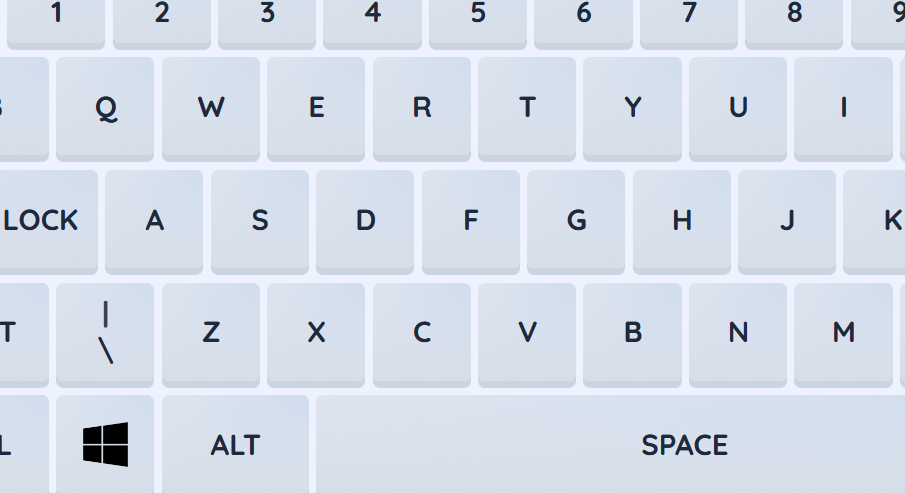

# KeeBoDo

KeeBoDo é um teclado virtual para o Português escrito em JavaScript Vanilla.

## Créditos
Som de clique por [Mixkit](https://mixkit.co) (modificado).

ícones por [Ionic](https://ionic.io/ionicons).
